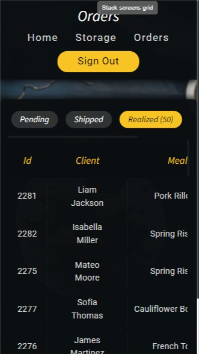

# Project Description

This site was built with **HTML, SCSS** and **PHP**. Entire site is connected to mysql database which is exported inside folder `db`. Database export have name `mainDB`.

This project also includes data generator for mysql table inserts that is written in python.

This website is responsive - works well on every device: smartphones, tables, laptops, etc..

# Code Lines

- **Hack (501 lines)** - Used for page structure
- **Clean PHP (501)** - Connecting to data base, fetching and presenting record and values
- **Python (501)** - Used to generate records database tables
- **Scss (501)** - Style entire page; Scss is written with using BEM coding guidelines.

# Selects List

Entire page fetches data from database with using ... selects total.

- [All mysql selects used on Dashboard Page](docs/DashboardTab.md) - 25 Total
- [All mysql selects used on Storage Page](docs/StorageTab.md) - 25 Total
- [All mysql selects used on Orders Page](dcs/OrdersTab.md) - 25 Total

# Project Showcase

### Login Page

From this site users can sign in to restaurant app. Login system or session checking on other pages isn't implemented.

|             Mobile Screen              |             Tablet Screen              |
| :------------------------------------: | :------------------------------------: |
|  |  |

### Dashboard Page

On this page restaurant admins can see most common statistics like revenues, pending orders or currently working employees and much more!
Mobile Screen | Tablet Screen
:-------------------------:|:-------------------------:
 | 

Laptop Screen |
:-------------------------:
 |

### Storage

On this page users can see orders. Page have build in filter - that can be used to present only pending, shipping or last 50 or 200 realized orders.

|              Laptop Screen               |              Mobile Screen               |
| :--------------------------------------: | :--------------------------------------: |
|  |  |

### Orders Page

On this page users can see ingredients inside restaurant storage. Thanks to filters users can pick all, nearly depleted or missing ingredients.
Mobile Screen | Tablet Screen
:-------------------------:|:-------------------------:
 | 
